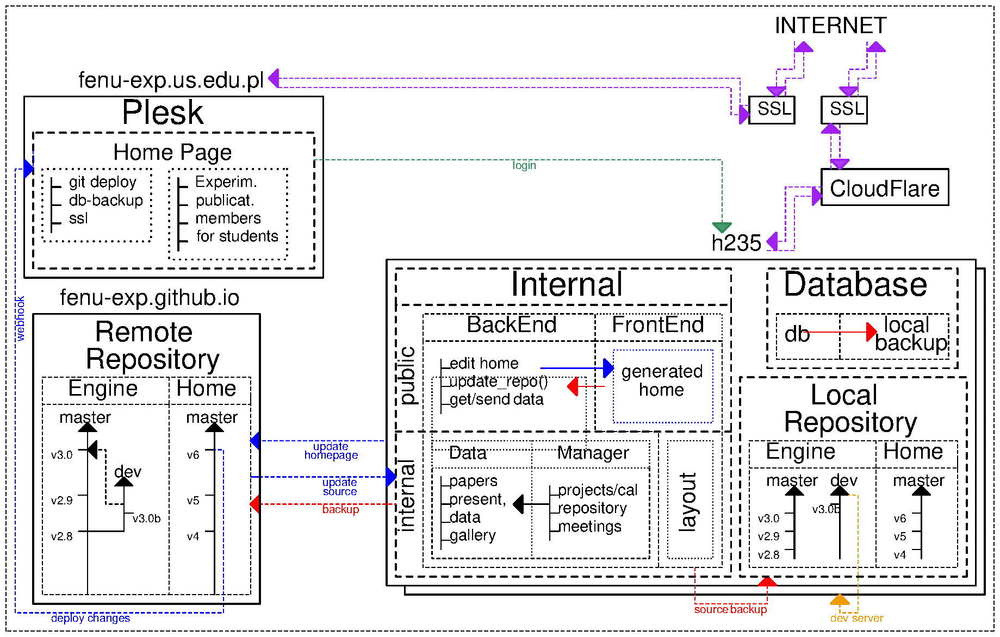

# BINA-experiment page

Web Service for the BINA Collaboration written in Flask microframework.

## Table of contents

- [Installation](#Installation)
	- [Developer](#Developer)
	- [Apache](#Apache)
- [Configuration](#Configuration)
	- [Server config](#Server)
	- [Internal config](#Internal)
- [App Structure](#App-structure)
- [Releases](#Releases)

## Installation

### Developer

Attention. **Do not use it in a production deployment for security reasons.**

1. Prepare python  environment
	- Create and activate virtual env
	`$: virtualenv venv`
	`$: source venv/bin/activate`
	- Install required modules
	`(venv)$: pip3 install -r requirements.txt`
	- Set local variables
	`(venv)$: export FLASK_APP=run.py`
	- Customize config.py and run.py

2. Create database
	- `(venv)S: mkdir database`
	- `(venv)$: flask db init`
	- `(venv)$: flask db migrate`
	- `(venv)$: flask db upgrade`

3. Create homepage
	- `mkdir App/static/homepage`
	- link git repository

4. Run server
	`(venv)$: python run.py` or `flask run -h <host> -p <port>`

### Apache

Temporarily unavailable

## Configuration

The configuration file consists of 2 parts, "server" and "internal".
"server" specifies e.g. secret keys, address binds, names, enviroment config.
The second part allows you to specify the app structue and layout like header names, options, variables etc.

### Server

### Internal

## Releases

- [v4.0](https://github.com/fenu-exp/fenu-exp.internal/releases/tag/v4.0) - first release of 4 version. App is a complete rewrite.
- [v3.5](https://github.com/fenu-exp/fenu-exp.internal/releases/tag/v3.5) - last release of 3.* version.
- ...outdated...

## App structure

